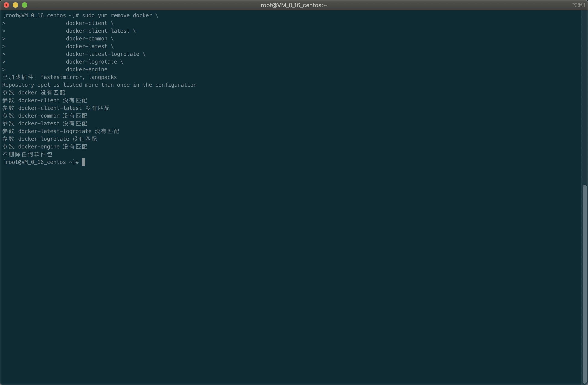
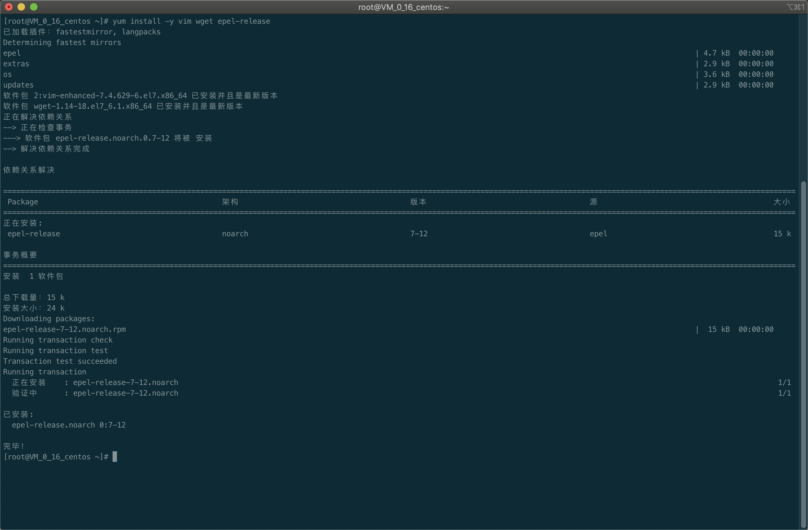
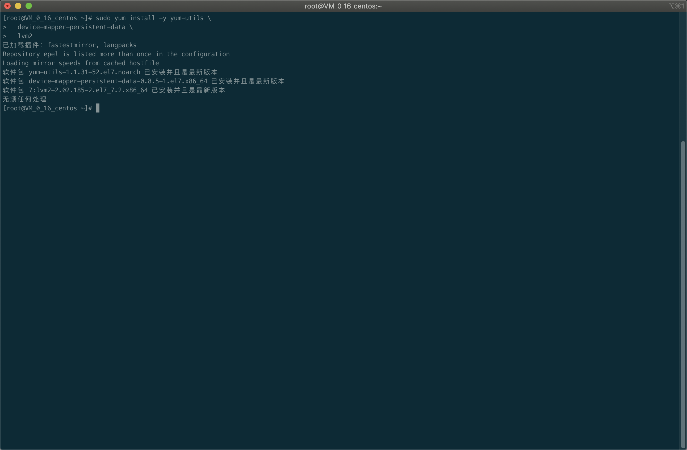
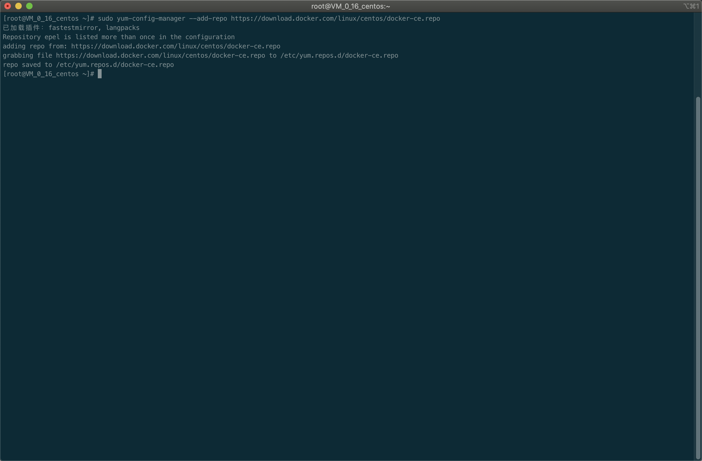
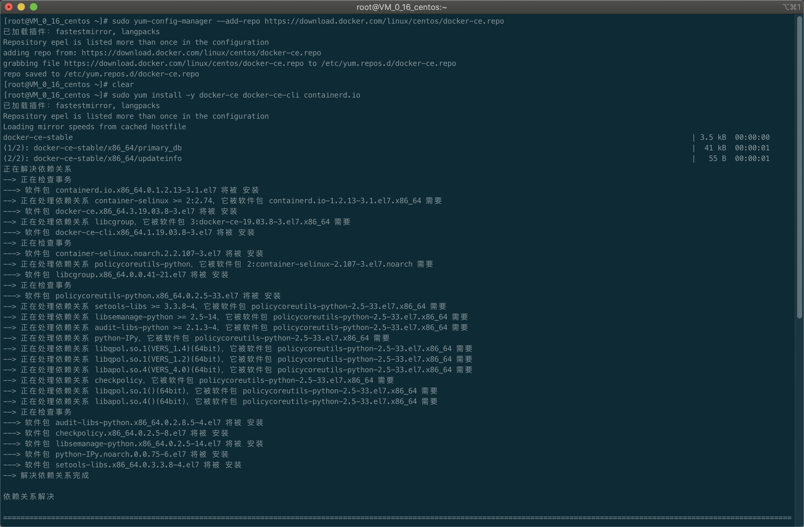
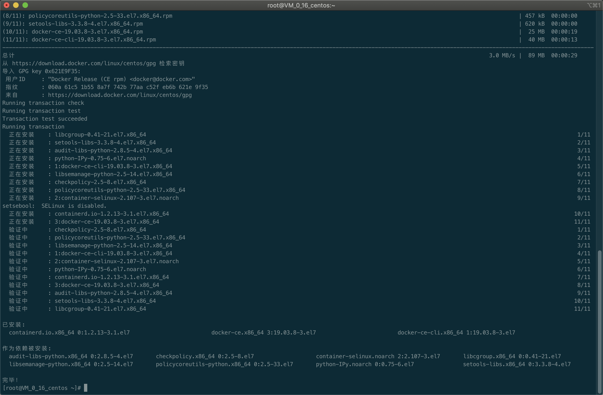
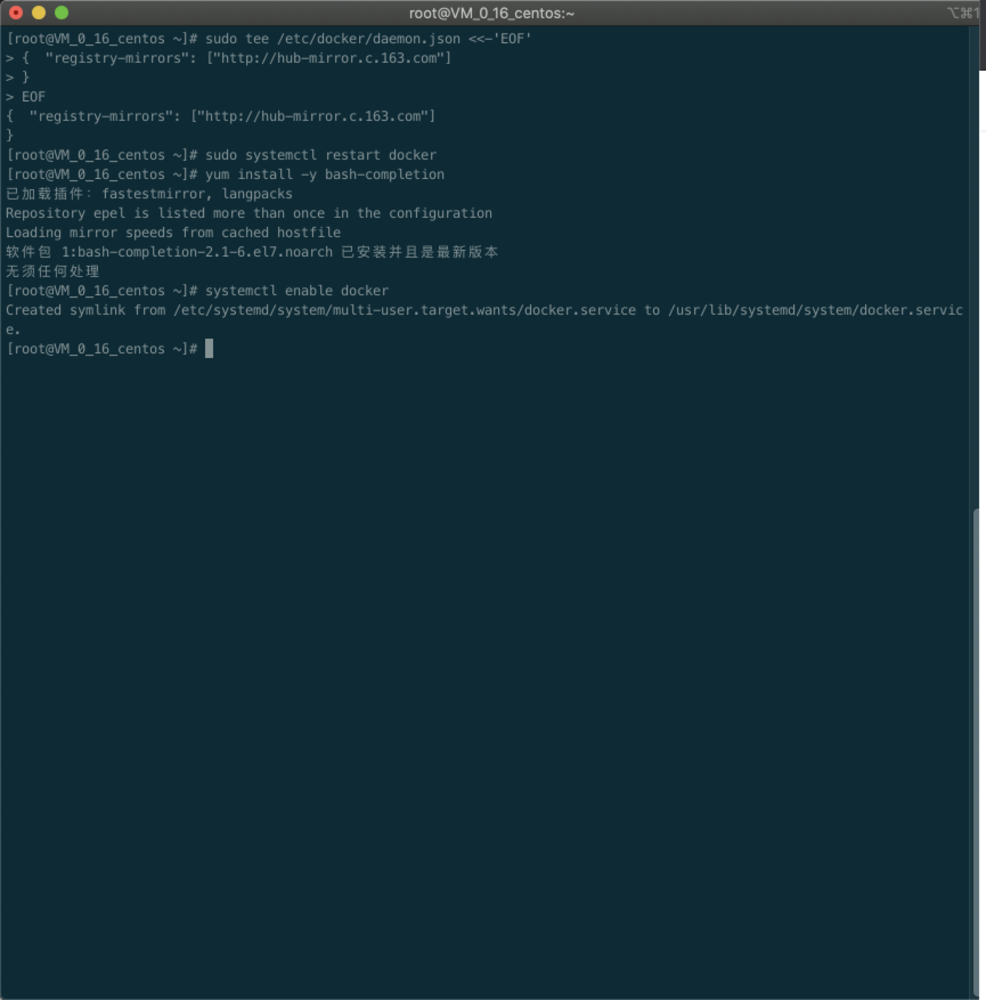

# Docker

Docker 是一个开源的应用容器引擎，基于 Go 语言 并遵从 Apache2.0 协议开源。

Docker 可以让开发者打包他们的应用以及依赖包到一个轻量级、可移植的容器中，然后发布到任何流行的 Linux 机器上，也可以实现虚拟化。

容器是完全使用沙箱机制，相互之间不会有任何接口（类似 iPhone 的 app）,更重要的是容器性能开销极低。

## Docker 的应用场景

- Web 应用的自动化打包和发布。

- 自动化测试和持续集成、发布。

- 在服务型环境中部署和调整数据库或其他的后台应用。

- 从头编译或者扩展现有的 OpenShift 或 Cloud Foundry 平台来搭建自己的 PaaS 环境。

## Docker 架构

Docker 包括三个基本概念:

- **镜像** (Image): Docker 镜像, 就相当于是一个 root 文件系统. 比如官方镜像 ubuntu:16.04 就包含了一套 Ubuntu16.04 最小系统的 root 文件系统

- **容器** (Container): 镜像和容器的关系, 就像面向对象程序设计中的类和实例一样, 镜像是静态的定义, 容器是镜像运行时的实体. 容器可以被创建、启动、停止、删除、暂停等

- **仓库** (Repository): 仓库可以看做一个代码控制中心, 用来保存镜像

Docker 使用客户端-服务器 (C/S) 架构模式，使用远程 API 来管理和创建 Docker 容器。

Docker 容器通过 Docker 镜像来创建。

容器与镜像的关系类似于面向对象编程中的对象与类。

## CentOS7 安装 Docker

### 卸载旧版本

旧的 Docker 版本称为 docker 或 docker-engine 如果已经安装过这些程序, 需要先卸载以及相关依赖

```shell
sudo yum remove docker \
                docker-client \
                docker-client-latest \
                docker-common \
                docker-latest \
                docker-latest-logrotate \
                docker-logrotate \
                docker-engine
```



### 安装 Docker

#### 安装 epel 更新源

```shell
yum install -y vim wget epel-release
```



#### 使用 Docker 仓库进行安装

在新主机上首次安装 Docker Engine-Community 之前, 需要设置 Docker 仓库. 之后可以从仓库安装和更新 Docker

##### 设置仓库

安装所需的软件包, yum-utils 提供了 yum-config-manager, 并且 device mapper 存储驱动程序需要 device-mapper-persistent-data 和 lvm2

```shell
sudo yum install -y yum-ytils \
  device-mapper-persistent-data \
  lvm2
```



鉴于国内网络问题, 执行以下命令添加 yum 软件源

```shell
sudo yum-config-manager \
  --add-repo \
  https://download.docker.com/linux/centos/docker-ce.repo
```



#### 安装 Docker Engine-Community

安装最新版本的 Docker Engine-Community 和 containerd

```shell
sudo yum install -y docker-ce docker-ce-cli containerd.io
```




### 配置 163 镜像加速

增加配置

```shell
sudo tee /etc/docker/daemon.json <<-'EOF'
{  "registry-mirrors": ["http://hub-mirror.c.163.com"]
}
EOF
```

重启 docker

```shell
sudo systemctl restart docker
```

安装 docker 命令补全工具

```shell
yum install -y bash-completion
```

设置 docker 开机启动

```shell
systemctl enable docker
```


